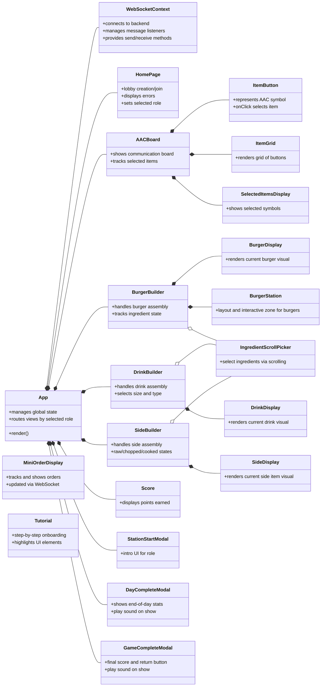

# Frontend Diagram

The following is a diagram of the main pieces and components involved in making our frontend application work. The flow goes from left to right where the App or entry point is on the left and the pieces that compose it are to the right. The diagram is sideways to allow everything to fit on the documentation screen.

