# Use Case Sequences

These are sequence diagrams that line up with the use cases, along with descriptions of how the system functions at each step.

---

## Use Case 1 – Create Lobby
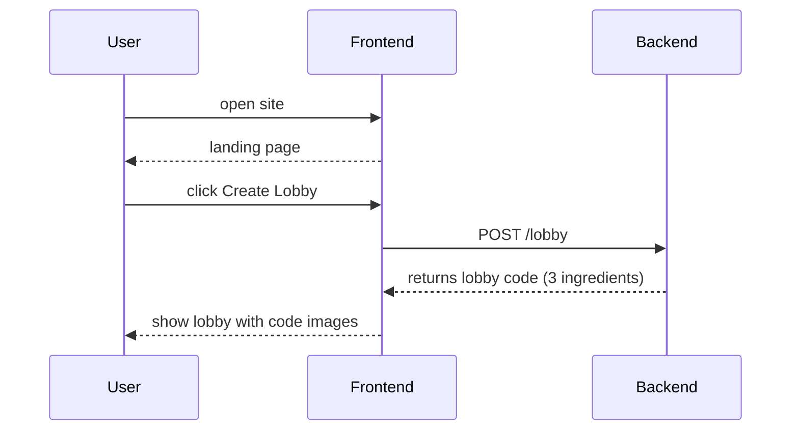
1. Frontend makes a POST /lobby request.  
2. Backend returns a unique three ingredient code.  
3. Frontend shows the lobby screen with the code.

---

## Use Case 2 – Share Lobby via Link

1. User clicks the copy icon.  
2. Frontend copies the lobby URL and shows a check mark.  
3. User pastes the link in an external chat.

---

## Use Case 3 – Share Lobby Code (Audio)
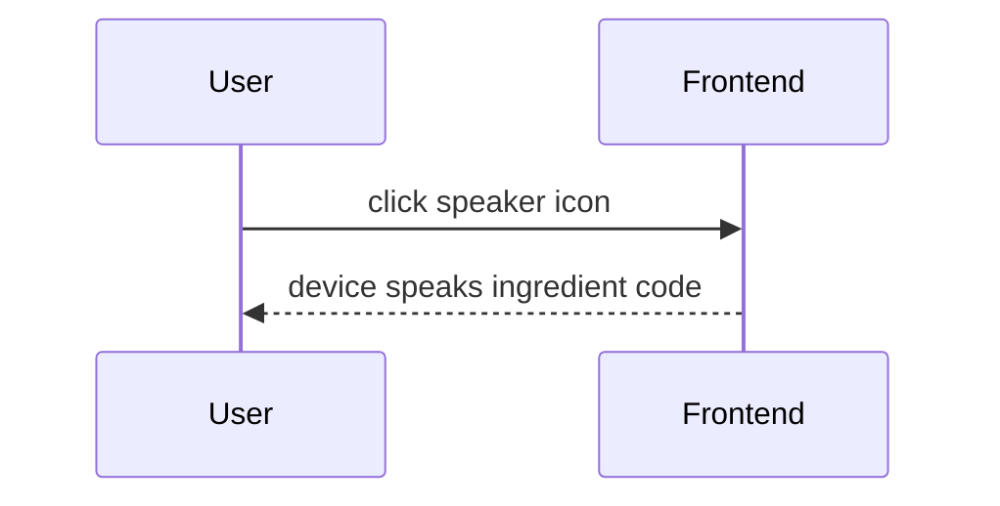
1. User clicks the speaker icon.  
2. Device reads each ingredient aloud for nearby friends.

---

## Use Case 4 – Join Lobby via Link
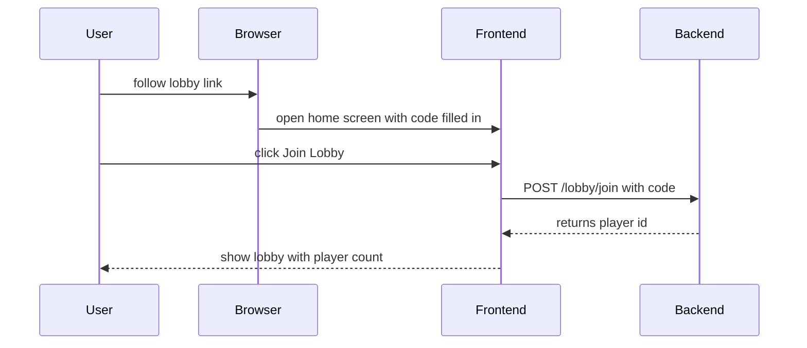
1. Join screen opens with the code filled in.  
2. Frontend POSTS /lobby/join with the code.  
3. Backend returns the player ID.  
4. Frontend shows the lobby view.

---

## Use Case 5 – Join Lobby via Manual Code Entry

1. User selects the three ingredients.  
2. Frontend POSTS /lobby/join with the code.  
3. Backend returns the player ID.  
4. Frontend shows the lobby view.

---

## Use Case 6 – Start Game
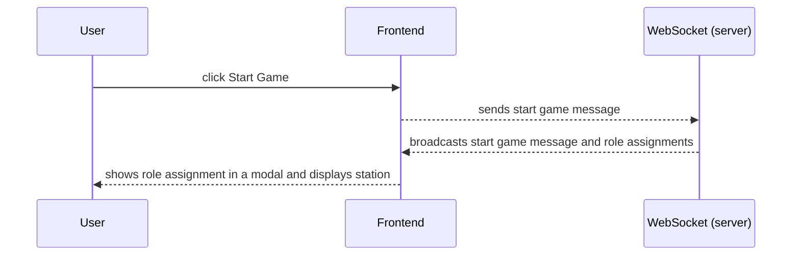
1. A user in the lobby clicks start game.
2. Frontend sends a start game message over WebSocket.  
3. Server broadcasts start game message and role assignments.  
4. Frontend shows the role modal and station.

---

## Use Case 7 – Walk through Joyride
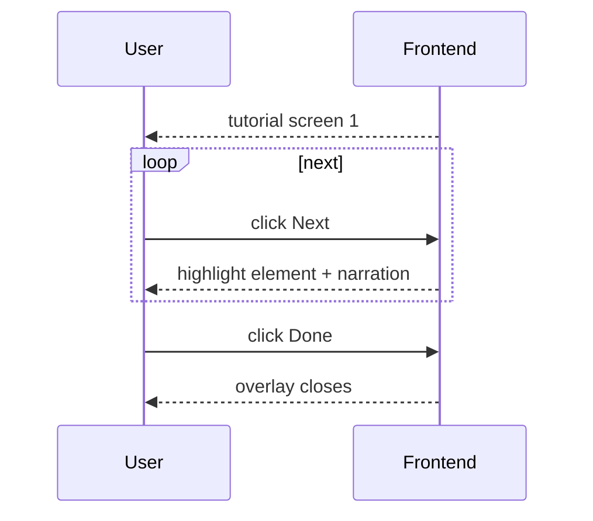
1. Frontend shows tutorial screens with narration.  
2. User steps through each screen.  
3. User clicks Done and gains control of the station.

---

## Use Case 8 – Skip Joyride

1. Frontend shows the first tutorial screen.  
2. User closes it, and Frontend enables station controls.

---

## Use Case 9 – Manager Receives Customer Order

1. Server sends a new order message.  
2. Frontend shows the customer's order in a thought bubble.

---

## Use Case 10 – Manager Relays Order with AAC
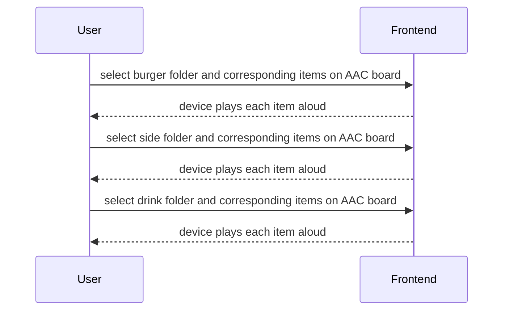
1. Manager taps the categories and the items needed in each one to play them aloud via the AAC Board.  
2. Device speaks each part of the order for employees to hear.

---

## Use Case 11 – Employee Listens to Order
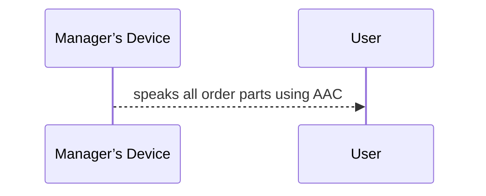
1. Employee hears the customer's order request from the manager.  
2. Employee notes the items for their station.

---

## Use Case 12 – Employee Requests Order Repeat

1. Employee presses the button to repeat the order.  
2. Employee’s device asks the manager to repeat the order aloud.

---

## Use Case 13 – Prepare Burger
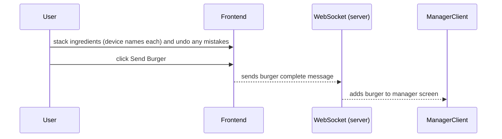
1. Burger cook selects and stacks ingredients, with the device speaking each ingredient name aloud - if they make any mistake they can press undo to take off the last ingredient placed.
2. Burger cook clicks the Send Burger button.
3. Frontend sends a burger message to the server.
4. Server sends a message to the manager's client, adding the burger to their screen.

---

## Use Case 14 – Prepare Sides

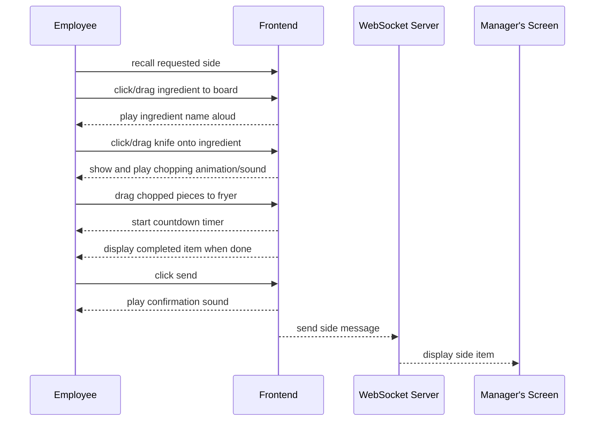

1. User does the cooking process on client side.
2. User clicks the send button.
3. Frontend sends the side message to the server.
4. Server displays the side item on the manager's screen.

---

## Use Case 15 – Prepare Drinks
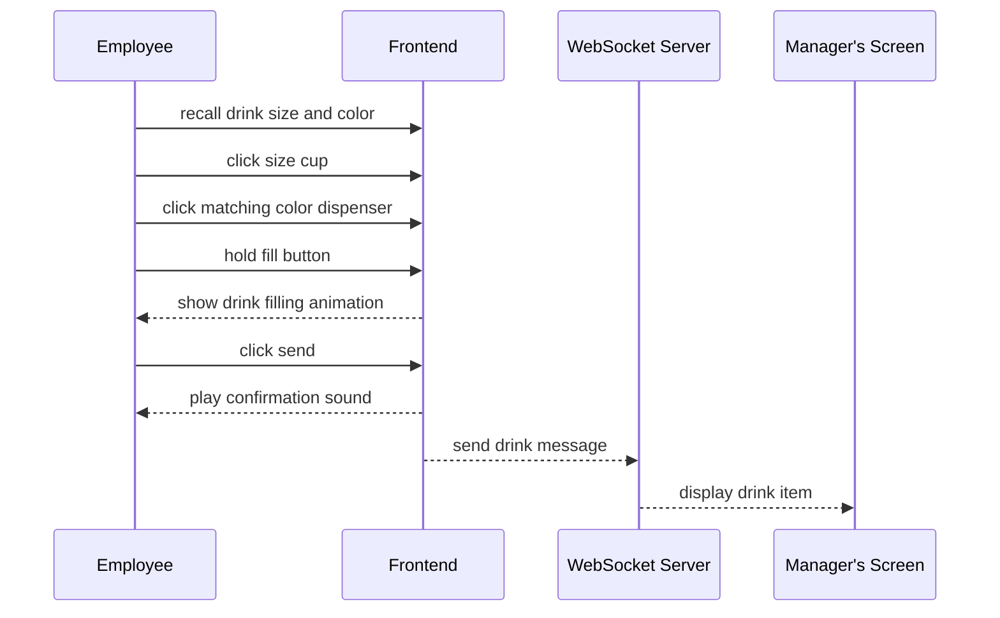
1. Drinks cook fills the correct drink.  
2. Frontend sends a drink message.  
3. Drink item appears on the manager’s screen.

---

## Use Case 16 – Manager Serves Order

1. Manager sees completed order items on the screen.  
2. Manager clicks Send Order.  
3. Backend scores the order and broadcasts new earnings.

---

## Use Case 17 – Day Complete

1. Server sends a day complete message.  
2. Frontend shows the Day Complete modal and summary.  
3. User clicks Next Day.  
4. Frontend loads the next day’s restaurant scene.

---

## Use Case 18 – Role Assignment for Next Day
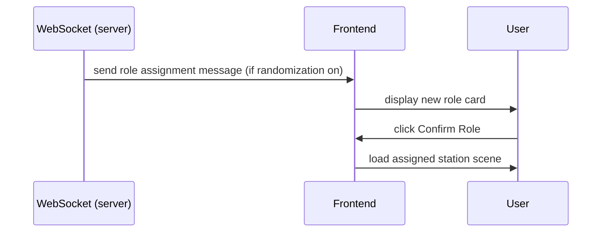
1. Server sends a role assignment message when roles change.  
2. Frontend displays the new role card.  
4. Frontend loads the station screen for that role.

---

## Use Case 19 – Game Complete
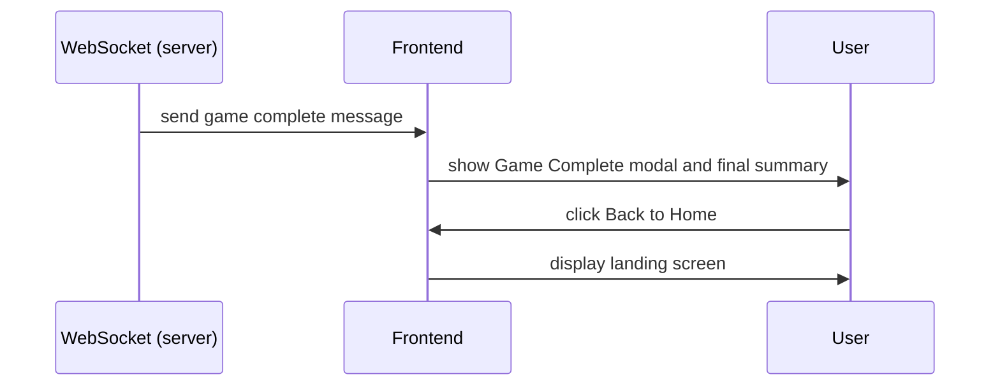
1. Server sends a game complete message after the final day.  
2. Frontend shows the Game Complete modal and final summary.  
3. User clicks Back to Home.  
4. Frontend displays the landing screen.
